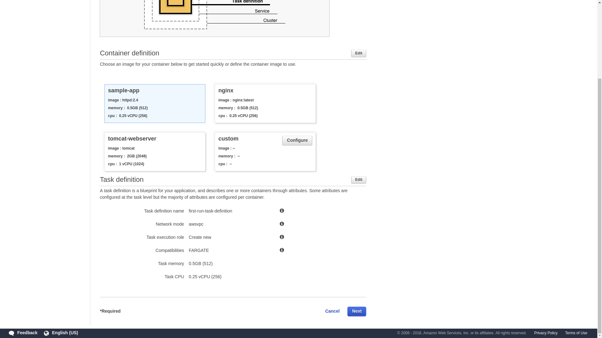
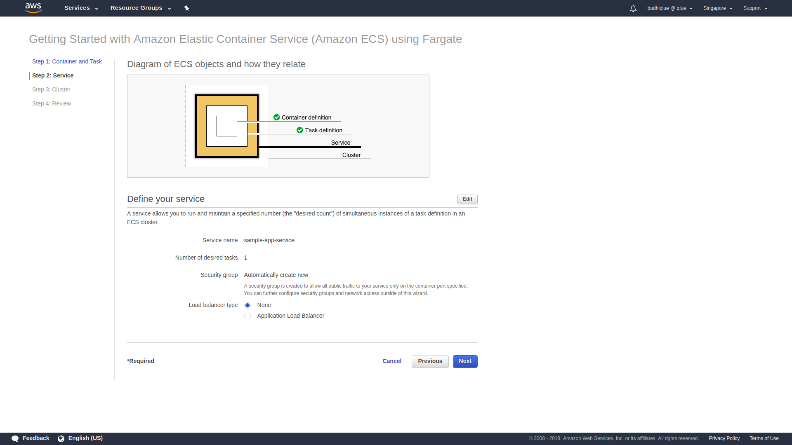
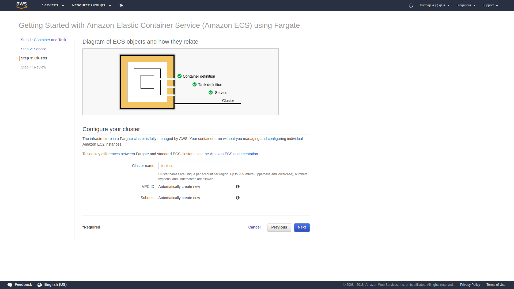
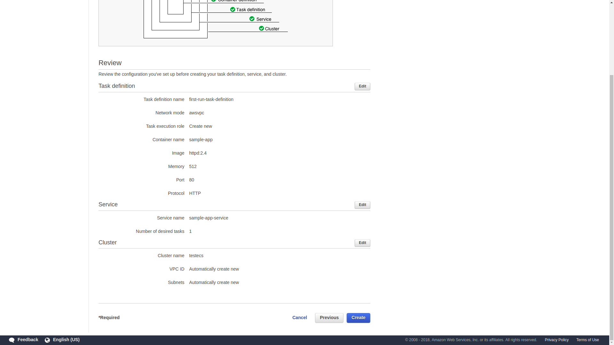
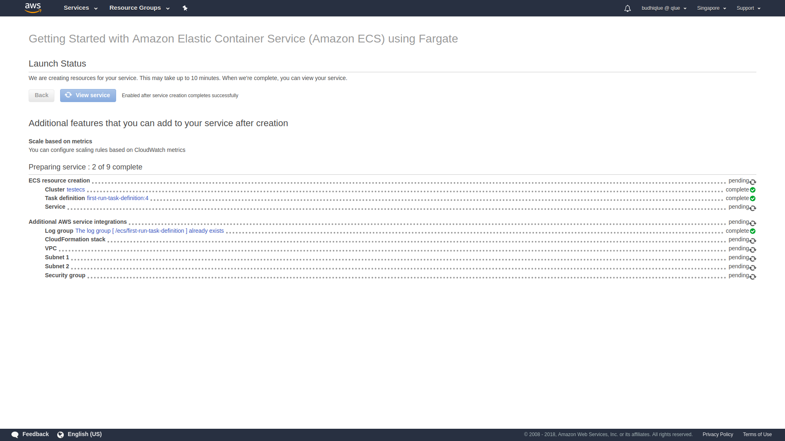
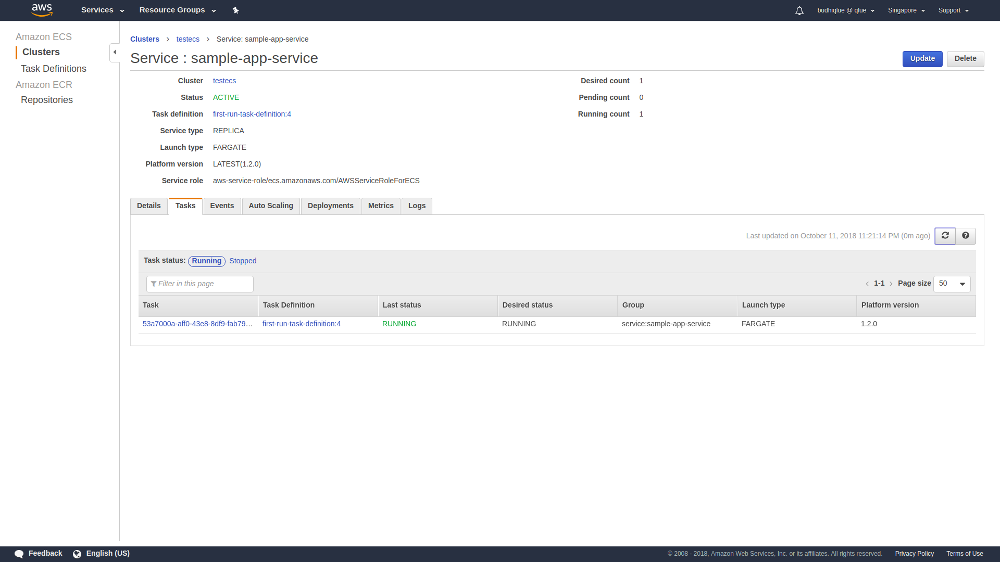
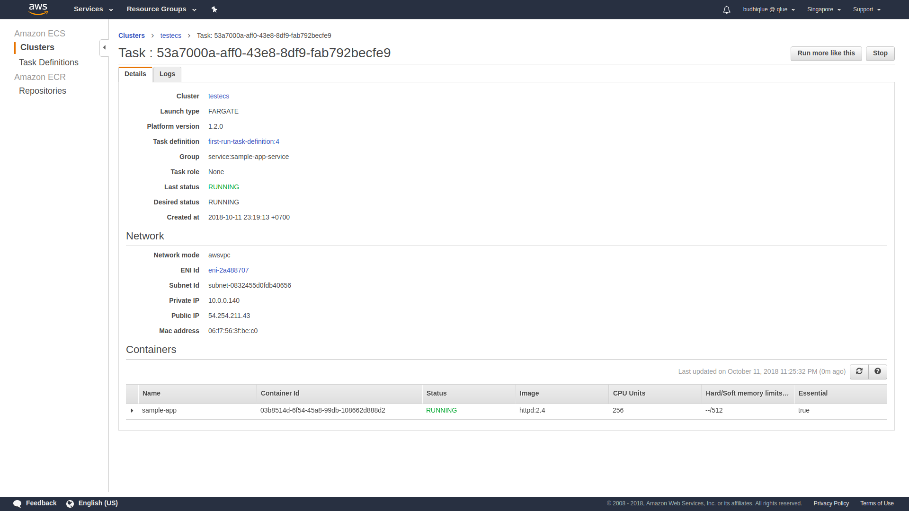
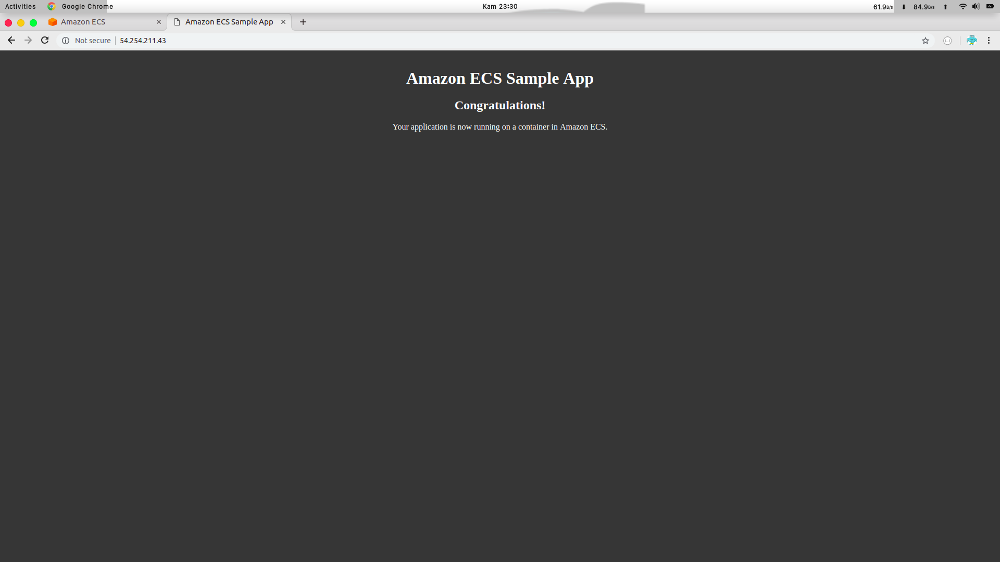

Getting Started with Amazon ECS using AWS Fargate
=================================================

  In this tutorial, you’ll create your first Amazon ECS <b>cluster</b>, define a <b>task definition</b> and a <b>container definition</b>, and deploy a <b>service</b> onto the cluster from these definitions..

| Object               | Description           |
| -------------------- |:----------------------|
| Cluster              | Logical grouping of tasks and services. Infrastructure may be shared between tasks and services running on the same cluster.         |
| Task Definition      | Blueprint for our application. Defines attributes such as CPU and memory requirements, networking configuration, and container definitions.              |
| Container Definition | Configuration for a container to run as part of our task. Defines attributes of the container including port mappings, resources requirements, environment variables, etc.              |
| Service              | Maintains a specified number of running simultaneous instances of a task definition in an ECS cluster.              |

You’ll deploy a service via Amazon ECS using AWS Fargate as the launch type. The Fargate launch type allows you to run your containerized applications without the need to provision and manage the backend infrastructure. Amazon ECS also can launch tasks and services using the EC2 launch type which runs containerized applications on Amazon EC2 instances that you manage. Amazon ECS is the orchestration service responsible for running docker containers and AWS Fargate is the underlying compute platform where the containers will run.

  
<b>Step 1</b>

  

    Go to the AWS Management Console, click <b>Services</b> then select <b>Elastic Container Service</b> under Compute. If you’ve never used the service before, you’ll see a <b>Getting started</b> button which will take you to the first run wizard. If you do not see this button, [navigate to the wizard directly](https://console.aws.amazon.com/ecs/home?region=us-east-1#/firstRun).
  

  
<b>Step 2</b>

  

    The first page of the wizard outlines configuration details to build our new task definition. We’re going to leave the defaults, but read through them to see what’s being configured. It will define a new task definition with a container definition for <b>sample-app</b> which is a container running Apache httpd with a splash page. Note that the task will run using the <b>FARGATE</b> launch type and it is configured for <b>0.5GB of RAM</b> and <b>1/4th of a vCPU</b>. Click <b>Next</b>.
  
  
  

  
<b>Step 3</b>

  

    The next page outlines configuration details for our service. By default it will create an app called <b>simple-app-service</b> running a single task in a new security group. Note we can optionally create a load balancer here to distribute traffic across tasks in our service. We won’t do this here but will later in the session. Leave the defaults and click <b>Next</b>.
  

  

  
<b>Step 4</b>

  

    The last page of the wizard allows us to name our cluster. Enter `testecs` into <b>Cluster name</b>. Clik <b>Next</b>.
  

  

  
<b>Step 5</b>

  

    Review the details of the new task definition, service, and cluster on the next page and click <b>Create</b>.
  

  

  
<b>Step 6</b>

  

    The first run wizard will create the task definition, service, and cluster and all supporting infrastructure. It will show you its progress as it runs:
  

  
  

    Once complete, click <b>View service</b>.
  

  
<b>Step 7</b>

  

    Click on the <b>Tasks</b> tab to see the tasks running by the service. The task status will transition from <b>PROVISIONING</b> to <b>PENDING</b> to <b>RUNNING</b> as the task is placed within AWS Fargate, the container is pulled and started. Click the refresh button while the task starts.
  

  

  
<b>Step 8</b>

  

    Once started, click the ID of the task in the <b>Task</b> column. This will show you task details including networking configuration:
  

  
  

    Note the <b>Public IP</b> of the task.
  

  
<b>Step 9</b>

  

    Open a web browser and navigate to the <b>Public IP</b> of the task. You’ll see the Hello World splash page:
  

  

