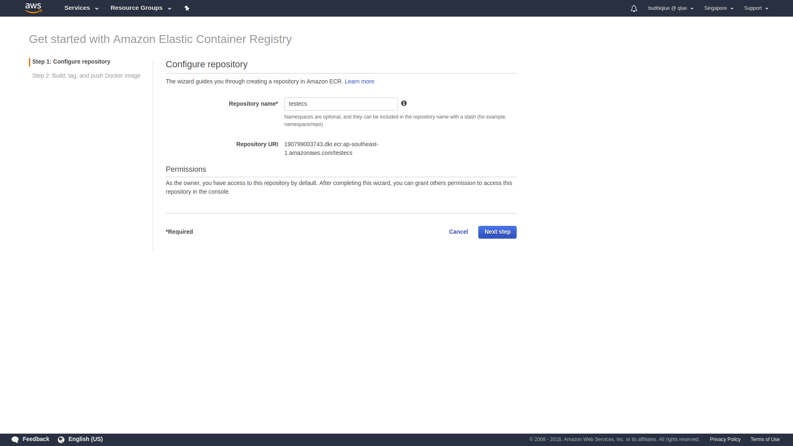
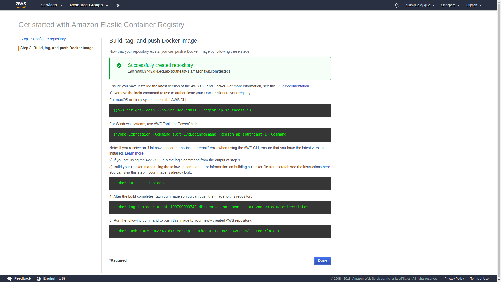

Create a Docker Image Repository
================================

  In this tutorial, you’ll create a Docker container image repository in Amazon Elastic Container Registry (ECR). Amazon ECR is a fully-managed Docker container registry that makes it easy for developers to store, manage, and deploy Docker container images without worrying about managing or scaling the underlying infrastructure.

  
<b>Step 1</b>

  

    Go to the AWS Management Console, click <b>Services</b> then select <b>Elastic Container Service</b> under Compute.
  

  
<b>Step 2</b>

  

    Click <b>Repositories</b> in the left-hand navigation.
  

  
<b>Step 3</b>

  

    Click <b>Get started</b> if this is your first visit to the Amazon ECR console, or <b>Create repository</b> if you’ve used it before.
  

  
<b>Step 4</b>

  

    Enter ``testecs`` into <b>Repository name</b>.
  

  
<b>Step 5</b>

  

    Note the contents of the <b>Repository URI</b> field.
  

  

  
<b>Step 6</b>

  

    Click <b>Next step</b>. Your repository has been created.
  

  

