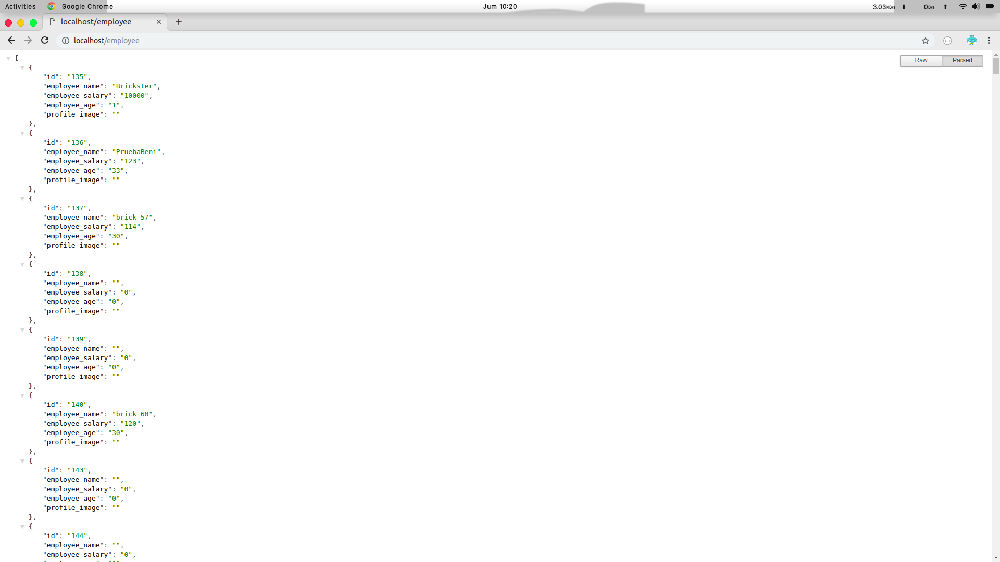

Build and Push a Docker Image
=============================

  This tutorial walks through the process of building and pushing a Docker image of a small web application for later deployment. A Docker image is a deployable artifact that includes both application code and its dependencies. In this module, you’ll clone a repository from GitHub into your workspace, build a Docker image from it, test it, and push it to the Amazon ECR repository created in the previous tutorial.

  The sample application is a simple web application for get employee datas. It’s written as a golang application and uses the Echo web framework.

  The application has one endpoint:

| Endpoint      | Are                    |
| ------------- |:----------------------:|
| GET /employee | Get all employee datas |

1. Build the Docker Image

  Clone the sample application from the [GitHub repo](https://github.com/budhip/simple-docker-golang-example) <b>OR YOU CAN CREATE SIMPLE APP WITH DOCKER BY YOURSELF</b> and build it using a tag of your repository from the repository URI you noted in the previous tutorial.

  

    
<b>Step 1</b>

    

      Open your terminal.
    

  

  

    
<b>Step 2</b>

    

      Clone the contents of the sample application to your environment by running `git clone https://github.com/budhip/simple-docker-golang-example.git` in your terminal.
    

  

  

    
<b>Step 3</b>

    

      In your terminal, change your working directory to the newly cloned application directory.  
      Example: `cd go/src/simple-docker-golang-example`
    

  

  

    
<b>Step 4</b>

    

      Build the Docker image and tag it using the repository URI you noted in the previous tutorial. For example, if the repository URI were `190799003743.dkr.ecr.ap-southeast-1.amazonaws.com/testecs`, then you’d run:
       
      docker build --tag 190799003743.dkr.ecr.ap-southeast-1.amazonaws.com/testecs .
       
      <b>Note:</b> Ensure that you change the image name to the repository URI you noted in the previous tutorial.
    

  

  

    
<b>Step 5</b>

    

      Verify that your Docker image has been built with the correct tag by running `docker images <repository URI>` in your terminal. For example:
       
      docker images 190799003743.dkr.ecr.ap-southeast-1.amazonaws.com/testecs
    

  

2. Test the Docker Image

  

    
<b>Step 1</b>

    

      Run the Docker container by running `docker run` in the your terminal using the Docker image we built in Point 1:
       
      docker run --detach --publish 80:80 --volume $HOME/.aws:/root/.aws \
  190799003743.dkr.ecr.ap-southeast-1.amazonaws.com/testecs    
    

    

       Let’s look at each part of the command to understand what it is doing:

       <table>
        <tbody>
          <tr>
            <th>Argument</th>
            <th align="center">Description</th>
          </tr>
          <tr>
            <td>-detach</td>
            <td align="left">Run the container in the background to allow us to use the terminal to run other commands.</td>
          </tr>
          <tr>
            <td>-publish 80:80</td>
            <td align="left">Expose the container port 80 on the host. This will allow us to connect to 127.0.0.1:80 and that traffic will be forwarded to your application running in the container.</td>
          </tr>
          <tr>
            <td>–volume $HOME/.aws:/root/.aws</td>
            <td align="left">Mount your AWS configuration onto the container. This gives your application access to your AWS credentials for use in testing.</td>
          </tr>
          <tr>
            <td>190799003743.dkr.ecr.ap-southeast-1.amazonaws.com/testecs</td>
            <td align="left">The docker image to run. Replace this parameter with the tag you used in point 1.</td>
          </tr>
        </tbody>
      </table>
    

  

  

    
<b>Step 2</b>

    

      Test the application by running `http://localhost:80/employee` in your web browser.
    

    
  

3. Push the Docker Image

  

    
<b>Step 1</b>

    

      Back to terminal
    

  

  

    
<b>Step 2</b>

    

      Log into your Amazon ECR registry using the helper provided by the AWS CLI in your terminal. `$(aws ecr get-login --no-include-email --region <your region>)`
       
      example: $(aws ecr get-login --no-include-email --region ap-southeast-1)
    

  

  

    
<b>Step 3</b>

    

      Push your Docker image. Ensure you change the image to the image tag you used in point 1:  
      docker push 190799003743.dkr.ecr.ap-southeast-1.amazonaws.com/testecs
    

  

