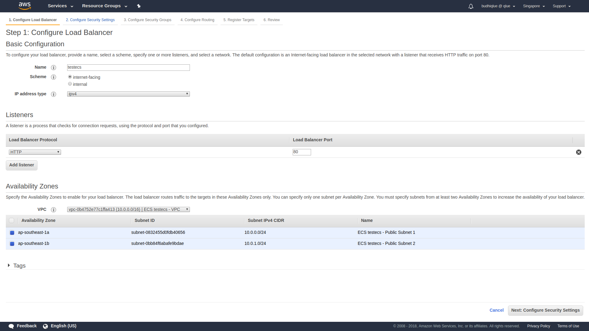

Create a Services
=================

  In this tutorial, you will create a new task definition and service to run the sample application we built in the previous tutorial. To support this service, you’ll need to create an AWS Identity and Access Management (IAM) role. We’ll also need to create an Application Load Balancer to distribute traffic across the running tasks that are being ran by the service.

1. Create the Task Role

  

    
<b>Step 1</b>

    

      Go to the AWS Management Console, click <b>Services</b> then select <b>IAM</b> under Security, Identity & Compliance.
    

  

  

    
<b>Step 2</b>

    

      Click on <b>Roles</b> in the left-hand navigation.
    

  

  

    
<b>Step 3</b>

    

      <b>Click Create role</b>.
    

  

  

    
<b>Step 4</b>

    

      First, we’ll configure which AWS service can assume this role. Click <b>Elastic Container Service</b> from the <b>Choose the service that will use this role</b> list.
    

  

  

    
<b>Step 5</b>

    

    Next, choose <b>Elastic Container Service Task</b> from <b>Select your use case</b>.
    

  

  

    
<b>Step 6</b>

    

      Click <b>Next: Permissions</b>.
    

  

  

    
<b>Step 7</b>

    

      Click <b>Next: Review</b>.
    

    
  

  

    
<b>Step 8</b>

    

      Enter `testecs` in <b>Role name</b>.
    

    
  

  

    
<b>Step 9</b>

    

      Click <b>Create role</b>.
    

  

2. Create the Task Definition

  Task definitions are blueprints for your application. They include details about what containers to run, their resource requirements, environment settings, networking configuration, and task role permission settings. In this step, we’ll create a task definition for our application.
  

    
<b>Step 1</b>

    

      Go to the AWS Management Console, click <b>Services</b> then select <b>Elastic Container Service</b> under Compute.
    

  

  

    
<b>Step 2</b>

    

    Click <b>Task Definitions</b> in the left-hand navigation.
    

  

  

    
<b>Step 3</b>

    

      Click <b>Create new Task Definition</b>.
    

  

  

    
<b>Step 4</b>

    

      Click <b>Fargate</b> to select the Fargate launch type.
    

    
  

  

    
<b>Step 5</b>

    

      Click <b>Next step</b>.
    

  

  

    
<b>Step 6</b>

    

      Enter `testecs` into <b>Task Definition Name</b>.
    

  

  

    
<b>Step 7</b>

    

      Select <b>testecs</b> from <b>Task Role</b>.
    

  

  

    
<b>Step 8</b>

    

      Select <b>0.5GB</b> from <b>Task memory (GB)</b>.
    

  

  

    
<b>Step 9</b>

    

      Select <b>0.25 vCPU</b> from <b>Task CPU (vCPU)</b>.
    

  

  

    
<b>Step 10</b>

    

      Click <b>Add container</b>.
    

  

  

    
<b>Step 11</b>

    

      Enter `testecs` into <b>Container name</b>.
    

  

  

    
<b>Step 12</b>

    

      In <b>Image</b>, paste the repository URI for the Docker image you built and pushed in the previous tutorial. For example, if your Account ID was 190799003743, then you’d enter: `190799003743.dkr.ecr.ap-southeast-1.amazonaws.com/testecs`
    

  

  

    
<b>Step 13</b>

    

      Enter `80` into <b>Container port</b> and select <b>tcp</b> from <b>Protocol</b> in b>Port mappings</b>.
    

    
  

  

    
<b>Step 14</b>

    

      Click <b>Add</b>.
    

  

  

    
<b>Step 15</b>

    

      Click <b>Create</b>.
    

  

3. Create an Application Load Balancer

  

    
<b>Step 1</b>

    

      Go to the AWS Management Console, click <b>Services</b> then select <b>EC2</b> under Compute.
    

  

  

    
<b>Step 2</b>

    

      Click on <b>Load Balancers</b> in the left-hand navigation.
    

  

  

    
<b>Step 3</b>

    

      Click <b>Create Load Balancer</b>.
    

  

  

    
<b>Step 4</b>

    

      In <b>Application Load Balancer</b>, click <b>Create</b>.
    

    
  

  

    
<b>Step 5</b>

    

      Enter `testecs` into <b>Name</b>.
    

  

  

    
<b>Step 6</b>

    

      Select the <b>VPC</b> created in the first module when you created the ECS cluster in the first module. If you need to find the VPC ID do one of the following: 
      <b>AWS Management Console</b>
        

          
<b>Step 1</b>

          

            Click on <b>Services</b>, right-click on <b>VPC</b> under Networking & Content Delivery and click <b>Open Link in New Tab</b>.
          

        

        

          
<b>Step 2</b>

          

            Click on <b>Your VPCs</b> in the left-hand navigation.
          

        

        

          
<b>Step 3</b>

          

            Click on each VPC, and click on its <b>Tags</b> tab. The VPC you’re looking for has a tag with <b>Key</b> `aws:cloudformation:stack-name` and <b>Value</b> `EC2ContainerService-workshop`
          

        

    

  

  

    
<b>Step 7</b>

    

      Select all <b>Availability Zones</b> configured for the VPC by checking each checkbox.
    

    
  

  

    
<b>Step 8</b>

    

      Click <b>Next: Configure Security Settings</b>.
    

  

  

    
<b>Step 9</b>

    

      The wizard will warn you that you’ve not established a secure listener as we didn’t define an HTTPS listener. Click <b>Next: Configure Security Groups</b>.
    

    
  

  

    
<b>Step 10</b>

    

      Tick the <b>Create a new security group</b> radio button. This will create a new security group which will permit traffic to port 80 by default.
    

    
  

  

    
<b>Step 11</b>

    

      Click <b>Next: Configure Routing</b>.
    

  

  

    
<b>Step 12</b>

    

      Enter `testecs` into <b>Name</b>.
    

  

  

    
<b>Step 13</b>

    

      Enter `80` into <b>Port</b>.
    

  

  

    
<b>Step 14</b>

    

      Select <b>ip</b> from <b>Target type</b>.
    

    
  

  

    
<b>Step 15</b>

    

      Click <b>Next: Register Targets</b>. We won’t register anything as we’ll rely on Amazon ECS to manage our Target Group for us.
    

  

  

    
<b>Step 16</b>

    

      Click <b>Next: Review</b>. Review the details you configured.
    

    
  

  

    
<b>Step 17</b>

    

      Click <b>Create</b>.
    

    
  

  

    
<b>Step 18</b>

    

      Click on the <b>testecs</b> link to view details about the new load balancer.
    

    
  

  

    
<b>Step 19</b>

    

      Click on the <b>testecs</b> link to view details about the new load balancer.
    

    
    

      Take note of the <b>DNSName</b>. This will be the hostname of our load balancer that we’ll use to hit our service after we complete the next set of steps.
    

  

4. Create the Service

Services maintain a desired number of tasks and manage registration of those tasks with a load balancer. In this section, we’ll create a new service for our Docker container.

  

    
<b>Step 1</b>

    

      Go to the AWS Management Console, click <b>Services</b> then select <b>Elastic Container Service</b> under Compute.
    

  

  

    
<b>Step 2</b>

    

      Click <b>testecs</b> in the cluster list.
    

  

  

    
<b>Step 3</b>

    

      The <b>Services</b> tab should be selected. <b>Click Create</b>.
    

    
  

  

    
<b>Step 4</b>

    

      Tick the <b>FARGATE</b> radio button in <b>Launch Type</b>.
    

  

  

    
<b>Step 5</b>

    

      Select <b>testecs:1</b> from <b>Task Definition</b>.
    

  

  

    
<b>Step 6</b>

    

    Enter `testecs` into <b>Service name/b>.
    

  

  

    
<b>Step 7</b>

    

      Enter `1` into <b>Number of tasks</b>.
    

    
  

  

    
<b>Step 8</b>

    

      Click <b>Next step</b>.
    

  

  

    
<b>Step 9</b>

    

      Select the <b>VPC</b> created in the first tutorial when you created the ECS cluster in the first tutorial.
    

  

  

    
<b>Step 10</b>

    

      Select both subnets in <b>Subnets</b>.
    

  

  

    
<b>Step 11</b>

    

      Select <b>ENABLED</b> from <b>Auto-assign public IP</b>. This allows your tasks to retrieve the Docker image from Amazon ECR and stream logs to Amazon CloudWatch Logs.
    

    
  

  

    
<b>Step 12</b>

    

      Under <b>Load Balancing</b>, tick the <b>Application Load Balancer</b> radio button.
    

  

  

    
<b>Step 13</b>

    

      Click <b>Add to load balanacer</b>.
    

  

  

    
<b>Step 14</b>

    

      Select <b>80:HTTP</b> from <b>Listener port</b>.
    

  

  

    
<b>Step 15</b>

    

      Select <b>testecs</b> from <b>Target group name</b>.
    

    
  

  

    
<b>Step 16</b>

    

      Click <b>Next step</b>.
    

  

  

    
<b>Step 17</b>

    

      The next page allows you to define an Auto Scaling policy. Leave this set to <b>Do not adjust the service’s desired count</b> for now and click <b>Next step</b>.
    

  

  

    
<b>Step 18</b>

    

      Review your settings and click <b>Create Service</b>.
    

  

  

    
<b>Step 19</b>

    

      The service will now start your task. Click <b>View Service</b> and wait for your task to transition to <b>RUNNING</b>.
    

    
      
     
  

  

    
<b>Step 20</b>

    

      Hit your task via the load balancer through the DNSName you noted in <b>3. Create an Application Load Balancer</b>. 
      You can hit via your web browser or postman
    

    
  

